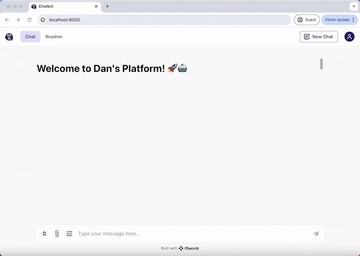

# Chatbot Project

## Environment Setup
1. **Create and activate a Conda environment**:
    ```bash
    conda create -y -n chatbot python=3.11
    conda activate chatbot
    ```
2. **Install required packages**:
    ```bash
    pip install -r requirements.txt
    ```
3. **Set up environment variables**:
    - Write your `OPENAI_API_KEY` in the `.env` file. A template can be found in `.env.example`.
    ```bash
    source .env
    ```
## Running the Application
To start the application, use the following command:

```bash
chainlit run app.py
```

## Features

### User Setting Panel
Users have the option to select the specific LLM (language learning model) they prefer for generating responses. The switch between different LLMs can be accomplished within a single conversation session.


### QA with RAG
- **Information Source**: The chatbot can retrieve information from web pages, YouTube videos, and PDFs.
- **Source Display**: You can view the source of the information at the end of each answer.
- **LLM Model Identification**:  The specific LLM model utilized for generating the current response is indicated.

### Conversation Memory
- **Memory Management**: The chatbot is equipped with a conversation memory feature. If the memory exceeds 500 tokens, it is automatically summarized.

## Presentation

Below is a preview of the web interface for the chatbot:



## Configuration

To customize the chatbot according to your needs, define your configurations in the `config.toml` file.
